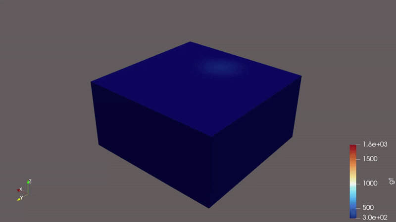
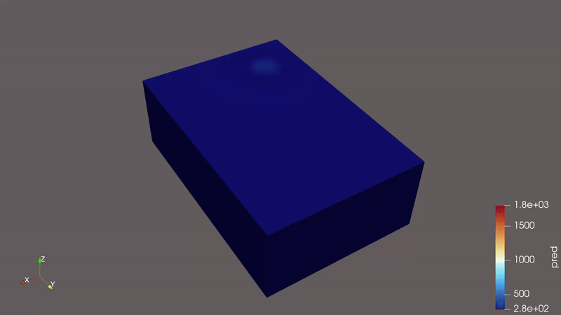
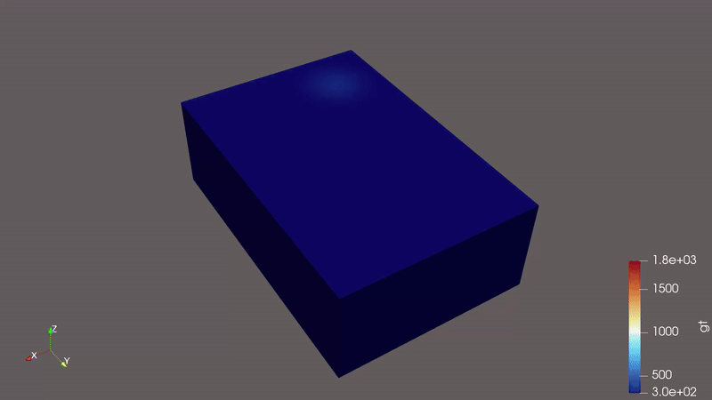
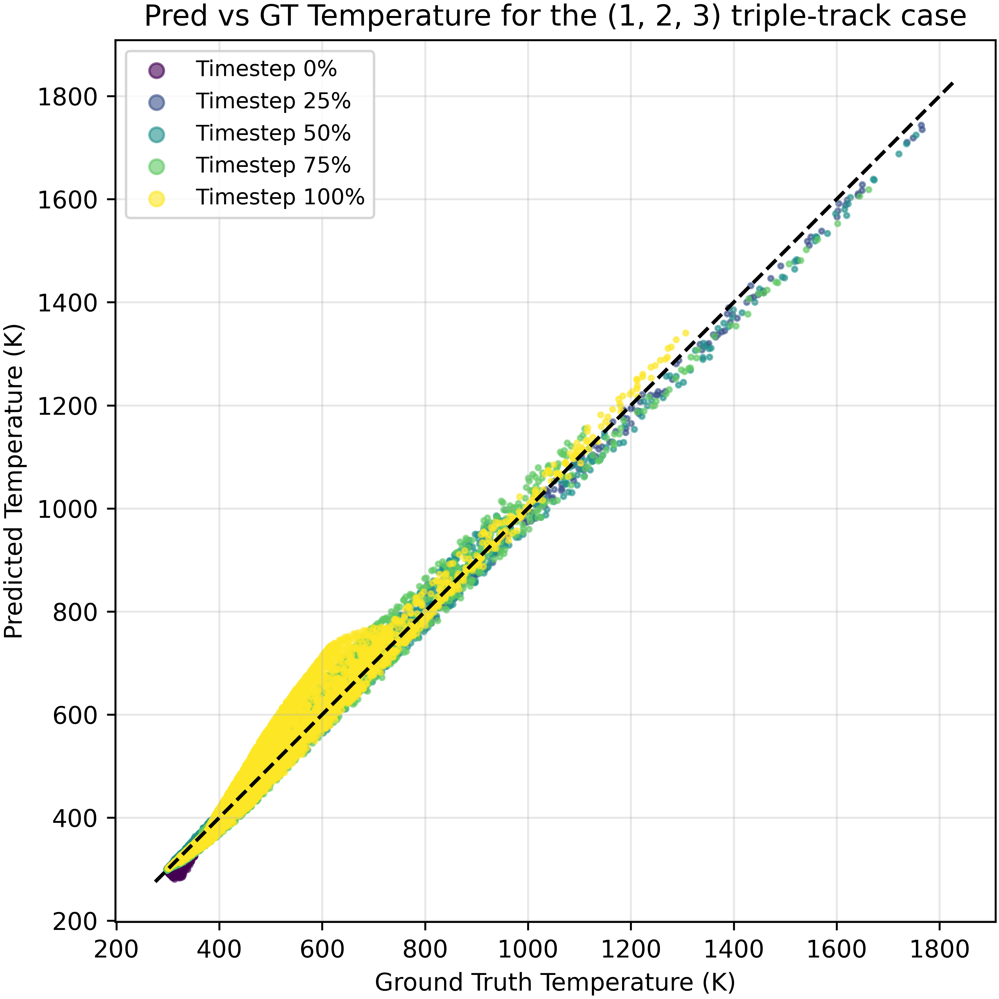
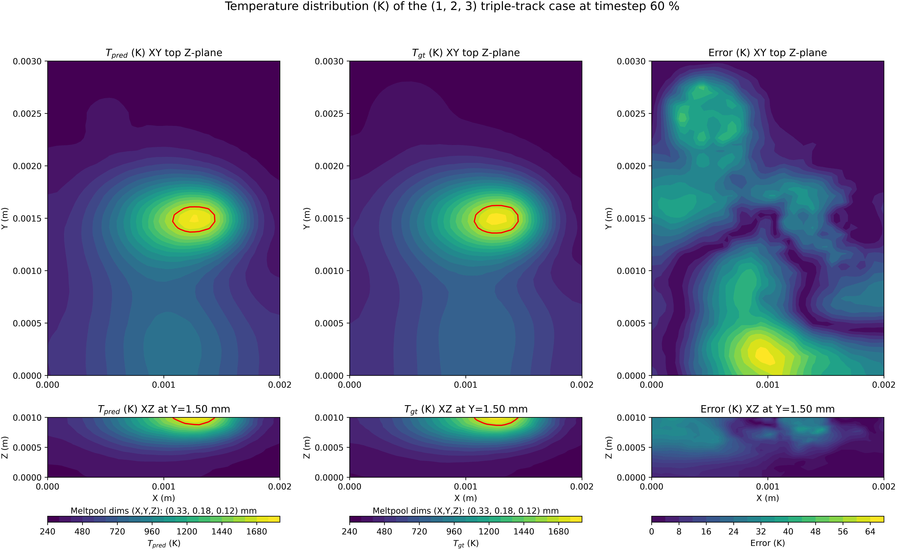
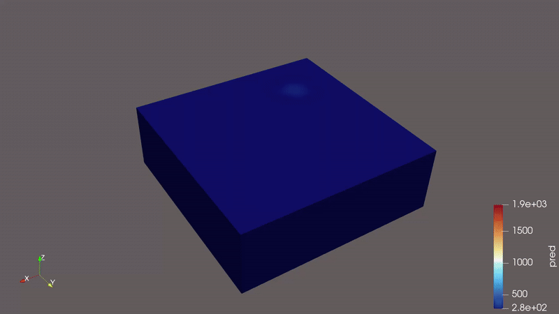
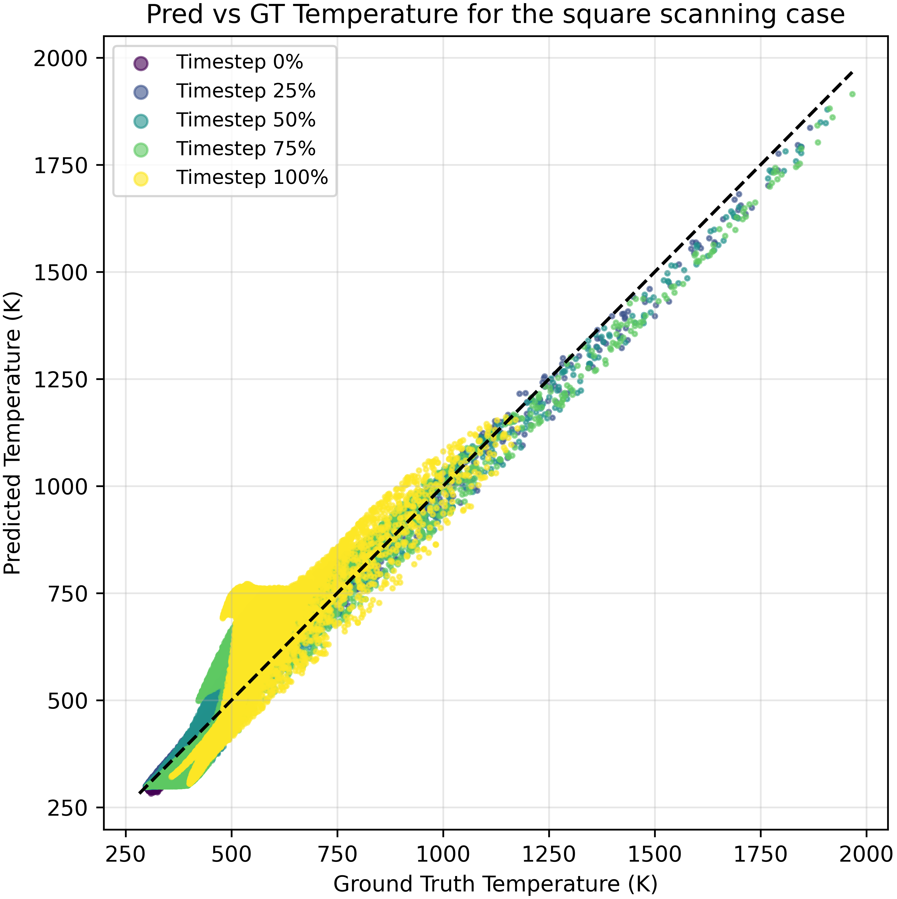
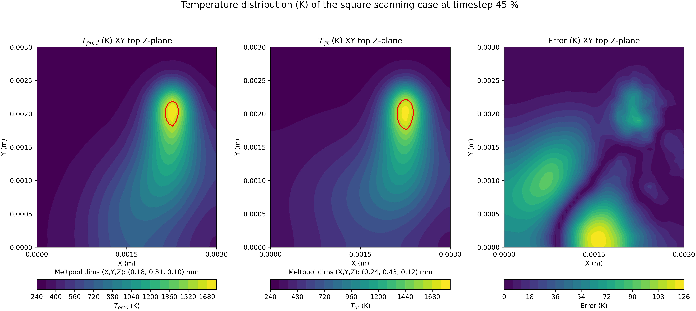

# Moving Heat Source Simulation using GNN Surrogate Models

Moving Heat Source Simulation is a key additive manufacturing (AM) technology, specifically Laser Powder Bed Fusion, that enables the fabrication of complex metal parts with high resolution and material efficiency. Numerical simulation of the moving heat source process plays a critical role in reducing the need for costly and time-consuming trial-and-error experimentation, thereby minimizing material waste and development time.
This project focuses on developing Graph Neural Network (GNN) based surrogate models to simulate heat diffusion with a moving heat source efficiently. Similar to the work on "Physics-Informed Surrogates for Temperature Prediction of Multi-Tracks in Laser Powder Bed Fusion" [[1]](#1), this project leverages GNNs, specifically MeshGraphNets [[2]](#2) and MPNN [[4]](#4) to model temperature evolution for different laser scanning pattern and extension to multi-track scanning, enabling fast and accurate predictions while reducing computational costs.
moving heat source, including:

* Laser-material interaction
* Steep thermal gradients
* Melt pool dynamics

Below is the example of simulation with single track scanning at the middle of the specimen.

## Heat Diffusion Equation and Moving Heat Source Model

The heat diffusion equation governs temperature evolution in a medium:

$$\rho c_p \frac{\partial T}{\partial t} = \nabla \cdot (k \nabla T) + Q(t)$$

where T is temperature, ρ density, c_p specific heat, k thermal conductivity, and Q volumetric heat source.

### Goldak Moving Heat Source

The Goldak double-ellipsoidal model defines a realistic moving heat input with front and rear quadrants using exponential heat flux distributions, capturing asymmetric thermal behavior in welding and laser processes.

The volumetric heat flux $Q(x,y,z,t)$ is defined differently for the front and rear halves of the heat source:

**Front quadrant** ($x \leq 0$):

$$Q_f(x,y,z,t) = \frac{6\sqrt{3}f_f Q \eta}{abc_f\pi\sqrt{\pi}} \exp{ -3\left( \frac{x^2}{a^2} + \frac{y^2}{b^2} + \frac{z^2}{c_f^2}  \right)}$$

**Rear quadrant** ($x > 0$):

$$Q_r(x,y,z,t) = \frac{6\sqrt{3}f_r Q \eta}{abc_r\pi\sqrt{\pi}} \exp{ -3\left( \frac{x^2}{a^2} + \frac{y^2}{b^2} + \frac{z^2}{c_r^2}  \right)}$$

Accurate simulation of these processes requires fine spatial and temporal discretizations, which lead to high computational costs. Additionally, optimization tasks, such as minimizing residual thermal energy, often necessitate multiple simulation runs, further increasing computational burden.

## Research Objective

To address these challenges, this research explores **surrogate modeling approaches** that can produce simulation results rapidly while maintaining acceptable accuracy compared to high-fidelity methods like the **Finite Element Method (FEM)**.
## Repository Structure

* `dataset/` – Example meshes and simulation datasets
* `selected_model/` – trained model on uniaxial and bending cases
* `ground_truth_generator/` - codes for generating groundtruth
* `core/` – The folder contains model architecture, rollout, data preprocessing and utilities codes
* `notebooks/` – Tutorials and step-by-step implementation

## Training
The model is trained based on one-step multiple prediction basis (1 function evaluation gives $n$ timestep predictions) adopting the message passing neural PDE framework [[4]](#4) to model transient heat diffusion with a moving Goldak heat source, enabling data-driven acceleration of thermal simulations.
## Example of Results
The model is trained on five trajectories: single-track (x and y axes), double-track (x and y axes), and circular scanning. 

Evaluation is performed on unseen scanning patterns, such as:
1. **Triple Track scanning**

  

    
    
Prediction

  

  

    
    
Ground Truth

  

  

    
    
Prediction vs Groundtruth Temperature

  

  

    
    
Prediction vs Groundtruth Temperature Field with Meltpool Geometry

  

2. **Square Track scanning**

  

    
    
Prediction

  

  

    
    
Ground Truth

  

  

    
    
Prediction vs Groundtruth Temperature

  

  

    
    
Prediction vs Groundtruth Temperature Field with Meltpool Geometry

  

### Accuracy and Speed Comparison
<!-- | Dataset | # Nodes | # Cells | RMSE T (K) | Max Error T (K)| Time FEM (s) | Time GNN (s) (speed up) |
|--------------|---------|--------|--------|--------------|--------------|--------------|
| Square   | 8.6k   | 49.6k   | 52.15 (10.50 %) |249.15 (49.71 %)| 191.81        | 4.0 ($\times 48$)          |
| Triple123    | 5.9k   | 33.5k  | 18.41 (3.33%) | 118.1 (19.25 %) | 62.57         | 1.0  ($\times 62$)        |
| Triple213    | 5.9k   | 33.5k  | 21.17 (4.13 % ) | 133.09 (18.12 %) | 62.39        | 1.0 ($\times 62$)      
| Triple321    | 5.9k   | 33.5k  | 18.21 (3.19 %)  |129.62 (20.13%) | 62.38        | 1.0  ($\times 62$)  |
| Quad1234    | 7.8k   | 44.2k  | 29.26 (5.57 %)  |162.444336 (29.24 %)| 110.16        | 2.0  ($\times 55$)   | -->

| **Dataset**     | **# Nodes** | **# Cells**  | **RMSE T (K)**       | **Time FEM (s)** | **Time GNN (s) (speed-up)** |
|------------|--------:|---------:|----------------:|-------------:|-------------------------:|
| Square      | 8.6k    | 49.6k    | 52.15 (10.50%)  | 191.81       | 4.0 (×48)               |
| Triple123   | 5.9k    | 33.5k    | 18.41 (3.33%)   | 62.57        | 1.0 (×62)               |
| Triple213   | 5.9k    | 33.5k    | 21.17 (4.13%)   | 62.39        | 1.0 (×62)               |
| Triple321   | 5.9k    | 33.5k    | 18.21 (3.19%)   | 62.38        | 1.0 (×62)               |
| Quad1234    | 7.8k    | 44.2k    | 29.26 (5.57%)   | 110.16       | 2.0 (×55)               |

## Summary

This project focuses on developing GNN-based surrogate models to accelerate moving heat source simulations, reduce computational cost, and enable rapid optimization, while preserving key physical insights from high-fidelity FEM simulations.
However, the model struggles to capture diffusion of the temperature in the cooling par (See both results)

---
## References
<a id="1">[1]</a> 
H. Safari and H. Wessels, "Physics-Informed Surrogates for Temperature Prediction of Multi-Tracks in Laser Powder Bed Fusion," arXiv preprint arXiv:2502.01820, 2025.

<a id="2">[2]</a> 
J. Goldak, A. Chakravarti, and M. Bibby, "A new finite element model for welding heat sources," Metallurgical Transactions B, vol. 15, no. 2, pp. 299--305, 1984.

<a id="3">[3]</a> 
T. Pfaff, M. Fortunato, A. Sanchez-Gonzalez, and P. W. Battaglia, "Learning Mesh-Based Simulation with Graph Networks," in International Conference on Learning Representations (ICLR), 2021.

<a id="4">[4]</a> 
J. Brandstetter, D. Worrall, and M. Welling, "Message Passing Neural PDE Solvers," arXiv preprint arXiv:2202.03376, 2023.
